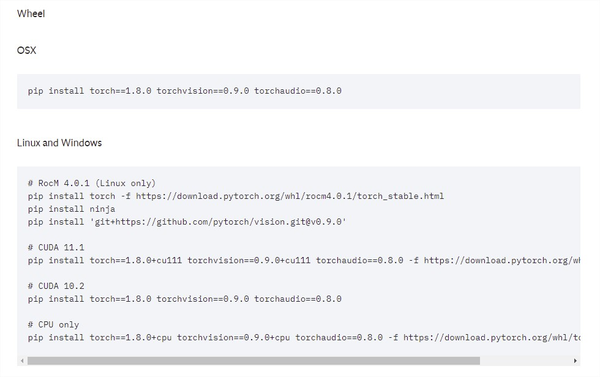

# Stochastic Transformer Networks with Linear Competing Units: Application to end-to-end Sign Language Translation 

This repository fork of the orignal [Stochastic Transformer Networks with Linear Competing Units: Application to end-to-end Sign Language Translation](https://github.com/avoskou/Stochastic-Transformer-Networks-with-Linear-Competing-Units-Application-to-end-to-end-SL-Translatio), has been created with the aim of supporting the study of intelligent models for sign language translation (SLT), which is part of the Master's Thesis (TFM) carried out for the [Master in Computer Engineering (MII)](https://www.mii.us.es/) of the [University of Seville](https://www.us.es/).

Automating sign language translation (SLT) is a challenging real-world application. Despite its societal importance, though, research progress in the field remains rather poor. Crucially, existing methods that yield viable performance necessitate the availability of laborious to obtain gloss sequence groundtruth. In this paper, we attenuate this need, by introducing an end-to-end SLT model that does not entail explicit use of glosses; the model only needs text groundtruth. This is in stark contrast to existing end-to-end models that use gloss sequence groundtruth, either in the form of a modality that is recognized at an intermediate model stage, or in the form of a parallel output process, jointly trained with the SLT model. Our approach constitutes a Transformer network with a novel type of layers that combines: (i) local winner-takes-all (LWTA) layers with stochastic winner sampling, instead of conventional ReLU layers, (ii) stochastic weights with posterior distributions estimated via variational inference, and (iii) a weight compression technique at inference time that exploits estimated posterior variance to perform massive, almost lossless compression. We demonstrate that our approach can reach the currently best reported BLEU-4 score on the PHOENIX 2014T benchmark, but without making use of glosses for model training, and with a memory footprint reduced by more than 70%

The code is based on:
1. Sign Language Transformers: Joint End-to-end Sign Language Recognition and Translation.
2. Joey NMT (https://github.com/joeynmt/joeynmt) 
3. Nonparametric Bayesian Deep Networks with Local Competition
4. Bayesian Compression for Deep Learning


## Reference

Please cite :

@inproceedings{voskou2021stochastic,
  title={Stochastic transformer networks with linear competing units: Application to end-to-end sl translation},
  author={Voskou, Andreas and Panousis, Konstantinos P and Kosmopoulos, Dimitrios and Metaxas, Dimitris N and Chatzis, Sotirios},
  booktitle={Proceedings of the IEEE/CVF International Conference on Computer Vision},
  pages={11946--11955},
  year={2021}
}

## SetUp

May differs from the original in [Stochastic Transformer Networks with Linear Competing Units: Application to end-to-end Sign Language Translation](https://github.com/avoskou/Stochastic-Transformer-Networks-with-Linear-Competing-Units-Application-to-end-to-end-SL-Translatio):

### Requirements
* python 3.6+
* virtualenv

## Installation

The recommended way to install is shown below:

```
# clone the repo
git clone https://github.com/manromero/Stochastic-Transformer-Networks-with-Linear-Competing-Units-Application-to-end-to-end-SL-Translatio
cd Stochastic-Transformer-Networks-with-Linear-Competing-Units-Application-to-end-to-end-SL-Translatio

# create a new virtual environment using python 3.6
virtualenv --python=python3 venv
# If you have more than one python, you can specify the python file. 
example: `virtualenv --python=C:\Users\migu1\AppData\Local\Programs\Python\Python36\python.exe venv`
# Activate linux:
source venv/bin/activate
# Activate windows:
.\venv\Scripts\activate

# Download the feature files:
data/download.sh
# If you are a window user, you may use: `bash ./data/download.sh` from cmd (change the name of the files if needed)
# You may also download the features files using the url inside the download.sh file.

# Install required packages using the `requirements.txt` file.
pip install -r requirements.txt
```

#### Known bugs for Windows users

##### Verify that torch has been installed correctly

```
python
> import torch
> torch.cuda.is_available()
# True -> The installation has been successfully completed and it is possible to use the graphics card for training.
# False -> Despite a successful installation, it will not be possible to make use of the graphics card during training, which will cause errors during training.
```

If false:

1. Make sure you have configured CUDA and CUDNN correctly. An example configuration for Windows 11 is available [here](https://youtu.be/OEFKlRSd8Ic?t=123).
2. Perform the Torch installation using the commands available from the [official PyTorch website](https://pytorch.org/get-started/locally/), removing the installed version beforehand. **Recomended version of PyThor 1.7 or 1.8**



**Example**

```
pip uninstall torch torchaudio torchvision
pip install torch==1.8.0+cu111 torchvision==0.9.0+cu111 torchaudio==0.8.0 -f https://download.pytorch.org/whl/torch_stable.html
```

Tested on a single GPU (not tested on CPU or multiple GPUs ).
## Usage

To train a model:

**Windows users may need to run the command in administrator mode [OSError: symbolic link privilege not held]**

  `python -m signjoey train configs/example.yaml`
  
To test  an excisting model:
  
  `python -m signjoey test configs/example.yaml`
  
Note that the default data directory is `./data`. If you download them to somewhere else, you need to update the `data_path` parameters in your config file.

## Acknowledgement
This  research  was  partially  supported  by  the  ResearchPromotion  Foundation  of  Cyprus,  through  the  grant:  INTERNATIONAL/USA/0118/0037  (Dimitrios  Kosmopoulos, Dimitris Metaxas), and the European Union’s Horizon2020 research and innovation program, under grant agreement  No  872139,  project  aiD  (Andreas  Voskou,  Sotirios Chatzis)
